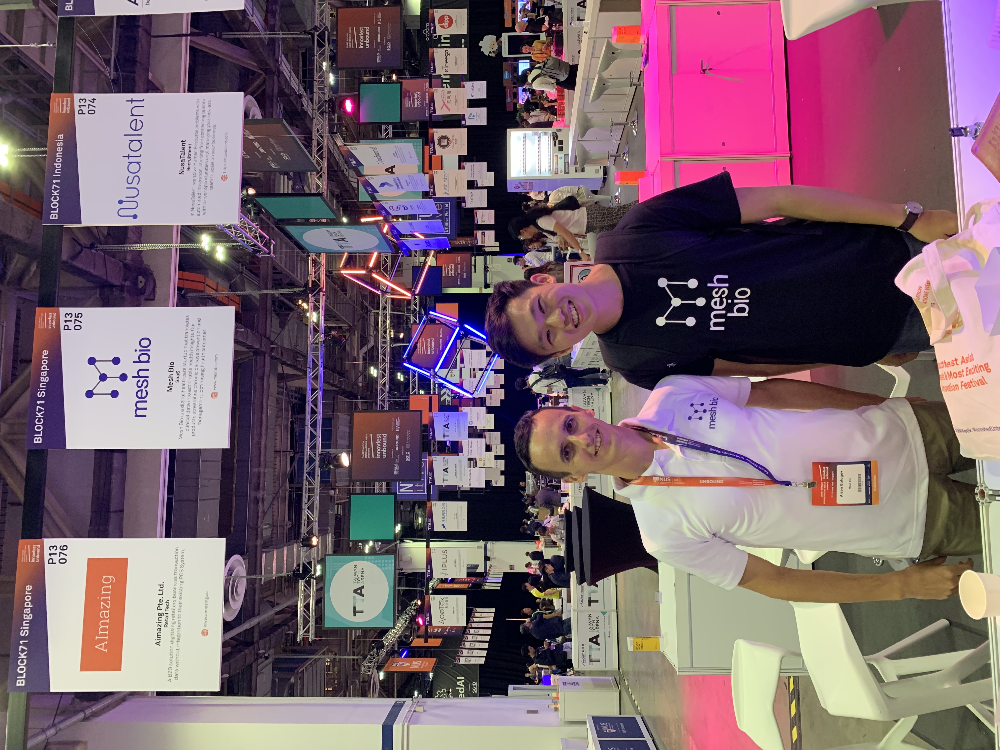

[Mesh Bio](www.meshbio.com) is a startup concerned with using predictive healthcare analysis to improve chronic disease management. Had the privilege of being Mesh Bio's first intern, working with the amazing, driven founders as a software engineer intern from Janurary 2019 - June 2019. This was my first foray into the world of tech.

* Worked closely with my founders in the early stages of the startup
* Prototyped rapidly to fulfil user requirements, as part of the company's "lean startup" framework.
* Developed DARA (Disease Associated Risk Assessment) data analysis engine for predictive analysis of 6 chronic diseases in Python, leading to deployment of DARA.
* Automated health screening report with marketing team using LaTeX and Matplotlib.
* Represented company at Innovfest Unbound 2019.

Many thanks to Arsen and Andrew for their guidance during my time with Mesh Bio!

<figure>

<figcaption>Arsen and Maxx, InnovFest 2019.</figcaption>
</figure>