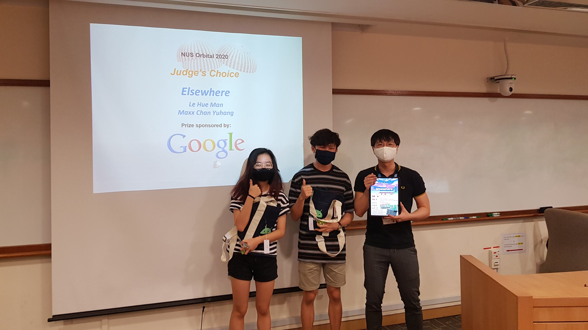

### Elsewhere - Judge's Choice, Orbital 2020

Having played many games ourselves, my partner, *Le Hue Man*, and I wanted to challenge ourselves to recreate one of our favourite game concepts, the turn-based strategy game. We were heavily inspired by classic titles like Final Fantasy Tactics and Fire Emblem. In the process, we hoped to discover the intricacies behind game design, improve our understanding of Object-oriented programming, and mastery of various languages or frameworks. 

*Man* and I developed a **turn-based strategy game**, **Elsewhere**, in Unity Engine over the course of our 3-month summer break, spending about 500 hours each on the project.
We were heavily inspired by classic titles like Final Fantasy Tactics and Fire Emblem. 

Creating a game required wearing **multiple hats** - being a developer, designer, and storywriter all at once. Of course, I had the privilege of working with Man, who came up with beautifully designed character sprites and maps, breathing life into Elsewhere. 

My contributions to Elsewhere are as follows:  
* Directing development cycle using AGILE methodology (user profiling, automated testing, user acceptance testing) and Kanban boards.
* Implementing pathfinding algorithms (Dijkstra, A*).
* Designing Enemy AI.
* Implementing software design patterns.
* Game design and technical design documentation.
* Crafting plot and dialogue.

Under the guidance of our mentor, [Candiie](https://www.linkedin.com/in/cwbay/) (who we really can't thank enough!), we were awarded the **Judge’s Choice Award**, the highest accolade given to the 3 out of 383 teams, evaluated based on quality of features, documentation, testing, and software engineering practices.

<figure>
    
    <figcaption>Maxx and Man, with Prof Zhao Jin. Orbital 2020 Awards Ceremony.</figcaption>
</figure>
 

**We are proud to present to you, Elsewhere. Please play it and experience the magic for yourself :D**

### Elsewhere 4-Minute Showcase

    <iframe src="https://www.youtube.com/embed/BS6tC7XHPzU" title="YouTube video player" frameborder="0" allow="accelerometer; autoplay; clipboard-write; encrypted-media; gyroscope; picture-in-picture" allowfullscreen></iframe>

 

### Links to Project Documents
- Github Downloadable Release: [https://github.com/maxxyh/elsewhere/v0.2.0](https://github.com/maxxyh/elsewhere/v0.2.0)
- 4-minute Video Showcase: [https://youtu.be/BS6tC7XHPzU](https://youtu.be/BS6tC7XHPzU)
- 10-minute Feature Demo: [https://youtu.be/3_uvgiFInms](https://youtu.be/3_uvgiFInms)
- Game Design and Technical Design Documentation: [http://bit.ly/ElsewhereReadmeMS3](http://bit.ly/ElsewhereReadmeMS3)

### LinkedIn Feature
<iframe src="https://www.linkedin.com/embed/feed/update/urn:li:share:6718791592175632384" height="1150px" width="100%" frameborder="0" allowfullscreen="" title="Embedded post"></iframe>